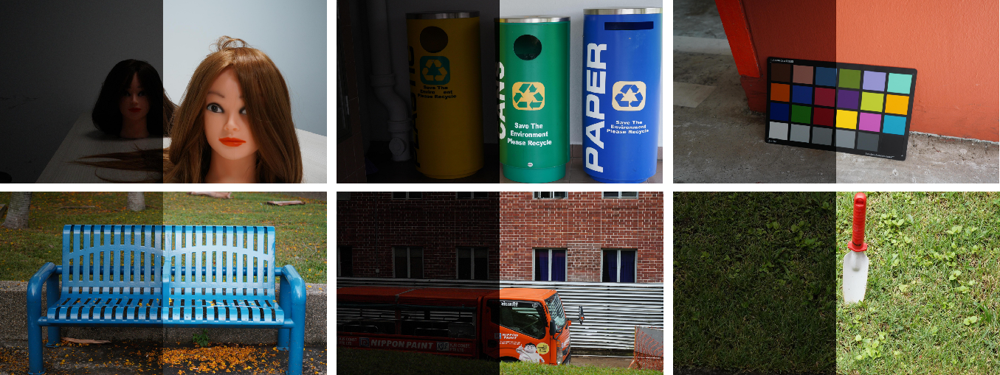
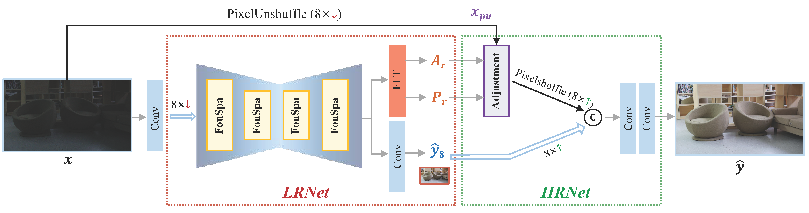

## Embedding Fourier for Ultra-High-Definition Low-Light Image Enhancement (ICLR 2023 Oral)

[Paper](https://arxiv.org/abs/2302.11831) | [Project Page](https://li-chongyi.github.io/UHDFour/) 

[Chongyi Li](https://li-chongyi.github.io/), [Chun-Le Guo](https://scholar.google.com.au/citations?user=RZLYwR0AAAAJ&hl=en),  [Man Zhou](https://manman1995.github.io/),  [Zhexin Liang](https://zhexinliang.github.io/),  [Shangchen Zhou](https://shangchenzhou.com/),  [Ruicheng Feng](https://jnjaby.github.io/),   [Chen Change Loy](https://www.mmlab-ntu.com/person/ccloy/) 

S-Lab, Nanyang Technological University; Nankai University

### Updates

- **2023.04.27**:  This repo is created.


---

### UHD-LL Dataset

(The datasets are hosted on both Google Drive and BaiduPan)
| Dataset | Link | Number | Description|
| :----- | :--: | :----: | :---- | 
| UHD-LL| [Google Drive](https://drive.google.com/drive/folders/1IneTwBsSiSSVXGoXQ9_hE1cO2d4Fd4DN?usp=share_link) / [BaiduPan (key: dz6u)]() | 2,150 | A total of 2,000 pairs for training and 150 pairs for testing.|
| LOL-v1| [Google Drive](https://drive.google.com/drive/folders/1HTMfTUq8nP_U_OlwWktsuuw26QKaLpTH?usp=share_link) / [BaiduPan (key: dz6u)]() | 500 | A total of 485 pairs for training and 15 pairs for testing.|
| LOL-v2| [Google Drive](https://drive.google.com/drive/folders/1xt94Msjh0hikZZ11BsZ1nseSV3_uVX8w?usp=share_link) / [BaiduPan (key: dz6u)]() | 789 | A total of 689 pairs for training and 100 pairs for testing.|


<details close>
<summary>[Unfold] for detailed description of each folder in UHD-LL dataset:</summary>

<table>
<td>

| UDH-LL               | Description             |
| :----------------------- | :---------------------- |
| training_set/gt                 | normal-light images |
| training_set/input          | low-light  images |
| testing_set/gt               | normal-light images |
| testing_set/input          |low-light  images |

</td>
</table>


</details>


## Environment

1. Clone Repo

   ```bash
   git clone <code_link>
   cd UHD-Net/
   ```

2. Create Conda Environment and Install Dependencies

   ```bash
   conda env create -f environment.yaml
   conda activate UHDFour
   ```

### Quick Inference
Before performing the following steps, please download our pretrained model first.

 **Download Links:** [[Google Drive](https://drive.google.com/drive/folders/1hLehCbHG-L-Dq4qJne5s721B6cfI1fSE?usp=share_link)] [[Baidu Disk (password: )]()]

Then, unzip the file and place the models to `ckpts/<dataset_name>` directory, separately.

The directory structure will be arranged as:
```
ckpts
   |-UHD_checkpoint.pt
   |-LOLv1_checkpoint.pt  
   |-LOLv2_checkpoint.pt
```

We provide some classic test images in the [`classic_test_image`](./data/classic_test_image/) directory.

Run the following command to process them:
```

CUDA_VISIBLE_DEVICES=X python src/test_PSNR.py --dataset-name our_test  

```
The enhanced images will be saved in the `results/` directory.

You can also run the following command to process your own images:
```
CUDA_VISIBLE_DEVICES=X python src/test_PSNR.py \
  --dataset-name our_test -t path/to/your/test/folder   
```
The `data` directory structure will be arranged as: (**Note**: please check it carefully)
```
data
   |- classic_test_image
      |- 1.bmp
      |- 01.jpg
      |- datalist.txt
   |-LOL-v1
      |- eval15
         |- gt
            |- 1.png 
            |- 22.png
         |- input
            |- 1.png 
            |- 22.png
         |- datalist.txt
      |- our485
         |- gt 
            |- 2.png 
            |- 5.png
         |- input
            |- 2.png 
            |- 5.png
         |- datalist.txt
   |-LOL-v2
      |- Test
         |- gt
            |- 00690.png 
            |- 00691.png
         |- input
            |- 00690.png 
            |- 00691.png
         |- datalist.txt
      |- Train
         |- gt 
            |- 00001.png 
            |- 00002.png
         |- input
            |- 00001.png 
            |- 00002.png
         |- datalist.txt
   |-UHD-LL   
      |- testing_set
         |- gt
            |- 1_UHD_LL.JPG 
            |- 7_UHD_LL.JPG
         |- input
            |- 1_UHD_LL.JPG 
            |- 7_UHD_LL.JPG
         |- datalist.txt
      |- training_set
         |- gt
            |- 2_UHD_LL.JPG 
            |- 3_UHD_LL.JPG
         |- input
            |- 2_UHD_LL.JPG 
            |- 3_UHD_LL.JPG
         |- datalist.txt
```
### Train
See `python3 src/train.py --h` for list of optional arguments, or `train.sh` for examples.

```
CUDA_VISIBLE_DEVICES=X python src/train.py \
  --dataset-name UHD \
  --train-dir ./data/UHD-LL/training_set/\
  --valid-dir ./data/UHD-LL/testing_set/ \
  --ckpt-save-path ./ckpts_training/ \
  --nb-epochs 1000 \
  --batch-size 2\
  --train-size 512 512 \
  --plot-stats \
  --cuda     
```

For the perceptual loss used in the paper, you can download the pre-trained VGG19 model from  [[Google Drive](https://drive.google.com/drive/folders/1MdNAkTkPkWzn6xSdU77eY2Dbd-xwLFb9?usp=share_link)] [[Baidu Disk (password: )]()].

### License

This project is licensed under <a rel="license" href="https://github.com/sczhou/LEDNet/blob/master/LICENSE">S-Lab License 1.0</a>. Redistribution and use for non-commercial purposes should follow this license.


### Citation
If our work is useful for your research, please consider citing:

```bibtex
@InProceedings{Li2023ICLR,
    author = {Li, Chongyi and Guo, Chun-Le and Zhou, Man and Liang, Zhexin and Zhou, Shangchen and Feng, Ruicheng and Loy, Chen Change},
    title = {Embedding Fourier for Ultra-High-Definition Low-Light Image Enhancement},
    booktitle = {ICLR},
    year = {2023}
}
```

### Contact
If you have any questions, please feel free to reach me out at `lichongyi25@gmail.com`.
